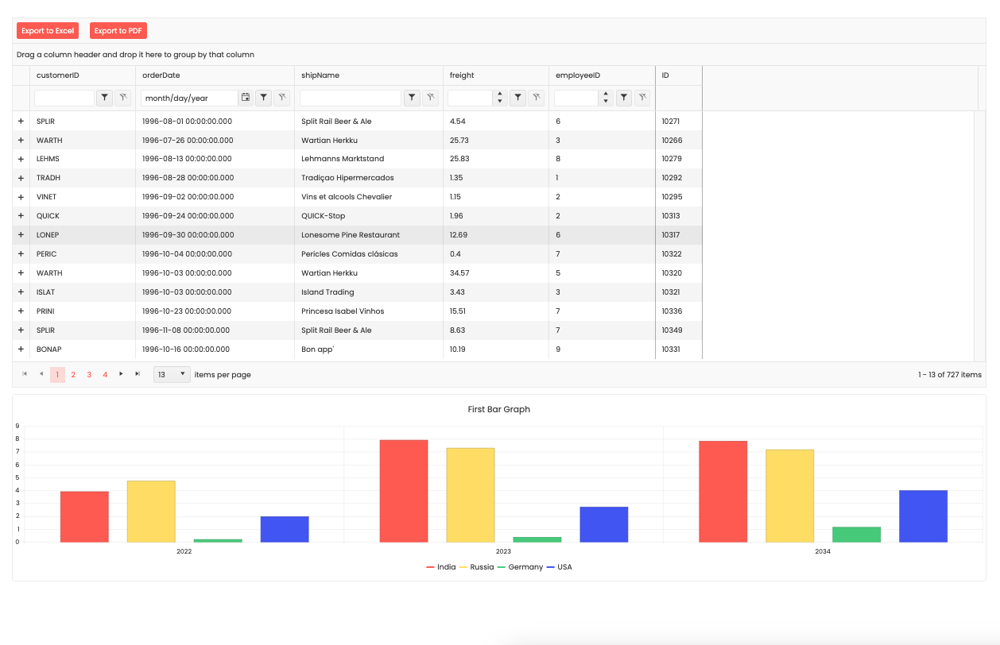
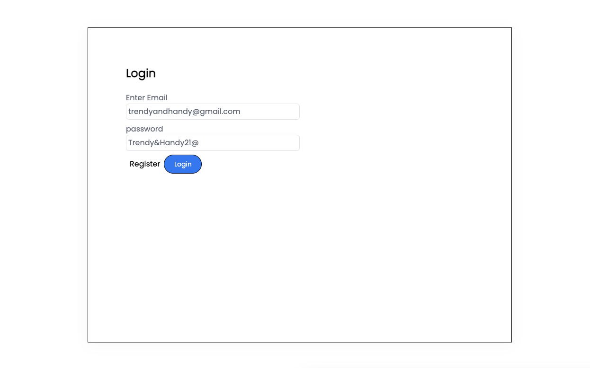
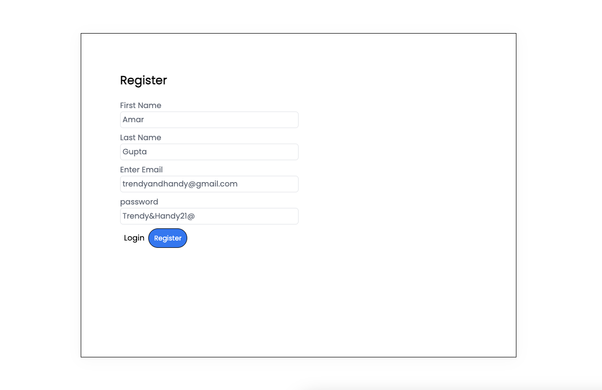

# Kendo React Toy Project

This is a toy project that showcases the integration of Kendo React components in a web application. The project includes both client-side and server-side implementations using various libraries and technologies.

**Client:**

- Redux Toolkit for state management
- Axios for handling API requests
- Formik for form management
- React Hot Toast for displaying toast notifications
- React Redux for integrating Redux with React components
- React Router DOM for handling routing
- Zustand for lightweight state management
- Kendo React for utilizing Kendo UI components

**Server:**

- CORS for enabling cross-origin resource sharing
- Express for building the server-side application
- JSON Web Token (JWT) for authentication and authorization
- Mongodb-memory-server for running an in-memory MongoDB instance for testing
- Mongoose for interacting with MongoDB
- Morgan for logging HTTP requests
- Multer for handling file uploads
- Nodemon for automatically restarting the server during development

**APIs:**

- `GET /api/getChartData`: Retrieves chart data
- `GET /api/getOrders`: Retrieves orders data
- `GET /api/getChartCategories`: Retrieves chart categories

The project includes pages for login, registration, and a home page that displays a Kendo table and graph component.

Feel free to explore the project and its functionalities.

